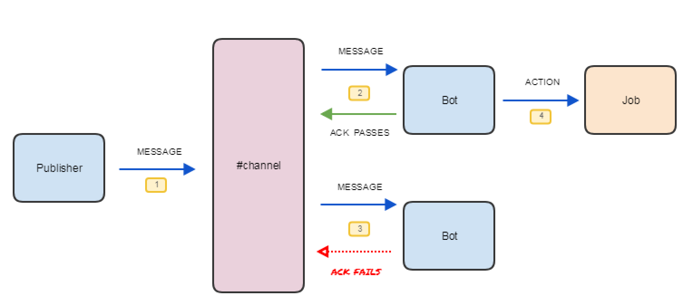

# SlackMQ

Slack can do the heavy lifting of a simple Message Queue. When a message is received,
it is "locked" while being processed. This keeps other worker bots from processing the
message simultaneously.

SlackMQ is suited to high latency message queuing applications due to rate limiting.
Scaling is limited to 16 "workers" per bot account. For a minimalist architecture,
leverage the power of SlackMQ and a Slack bot becomes highly available out of the box.

The Slack API allows reactions, pins and stars to be added to a post once per bot.
For example, a bot cannot give a post a thumbs up twice. In the UI, if you try, it
revokes the reaction. In the API, an exception is thrown.



The Slack RTM API allows a bot to connect multiple times. With this account concurrency, 
Slack can be made to behave like a basic Message Queuing system by using reactions,
pins or stars to acknowledge a message.

To use SlackMQ, wrap the post acknowledgement around a bot action. Below is an example
of how a chatbot using the slackbot library uses SlackMQ to pull from the "queue", 
i.e, the channel.

<script src="https://gist.github.com/meltaxa/bd359867cf804fe93ea87fabdc5e1c63.js"></script>

To install:
```
pip install slackmq
```

# Implementation Examples

Troupe, which is a group of Slack bots working together to control and operate a smart 
home implements SlackMQ. 
- See Troupe's source code for an insight into SlackMQ usage: https://github.com/meltaxa/troupe.

Another implementation of SlackMQ is to perform DevOps manoeuvres, such as
Remote Management, Continuous Delivery, Canary Deployments and Rolling Updates. In the
Troupe example, a Federation of Slack bots can self-update with zero downtime using the
SlackMQ library. Watch The Travelling DevOps Troupe in action:

[](https://www.youtube.com/watch?v=7TuYA2jt-Vc "The Travelling DevOps Troupe)
